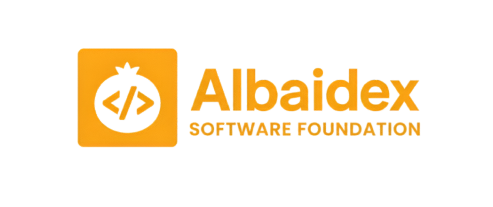

# Albaidex Software Foundation

**Engineered in Granada. Built for real people.**

Albaidex is a non-profit engineering collective dedicated to building free software, open knowledge, and useful tools — with no commercial agenda, no ads, and no data monetization.

---

## What we build

| Area | Description |
|---|---|
| **Open Learning** | Free educational resources, guides, wikis and tutorials for everyone |
| **Engineer Tools** | Open infrastructure, automation systems and developer tooling |
| **Freemium Apps** | Free-to-use applications built for everyday human needs |

---

## Our principles

- **Transparency** — Our processes are open. Our decisions are documented.
- **No commercial agenda** — We don't sell software, run ads, or monetize user data. Ever.
- **People over metrics** — We measure success by real human impact.
- **Efficiency over ceremony** — We ship results, not hours.
- **Technology as a tool** — Applied where it genuinely helps. Resisted where it doesn't.

---

## Get involved

We are a fully remote, volunteer-driven community. No mandatory hours. No hierarchy. Just people building things that matter.

- [Contribution Guidelines](https://albaidex.com/legal/contribution)
- [Voluntary Collaboration Agreement](https://albaidex.com/legal/collaboration)
- [Code of Conduct](https://albaidex.com/legal/code-of-conduct)
- [Security Policy](https://albaidex.com/legal/security)

---

## Contact

| Purpose | Email |
|---|---|
| General inquiries | contact@albaidex.com |
| Developers & contributors | dev@albaidex.com |
| Partnerships & collaboration | partners@albaidex.com |
| Security vulnerabilities | security@albaidex.com |
| Legal & compliance | legal@albaidex.com |

---

## Find us

[albaidex.com](https://albaidex.com) · [LinkedIn](https://linkedin.com/company/albaidex) · [Instagram](https://instagram.com/albaidex) · [YouTube](https://youtube.com/@albaidex)

---

*Granada, 18010, España — © 2026 Albaidex Software Foundation*
